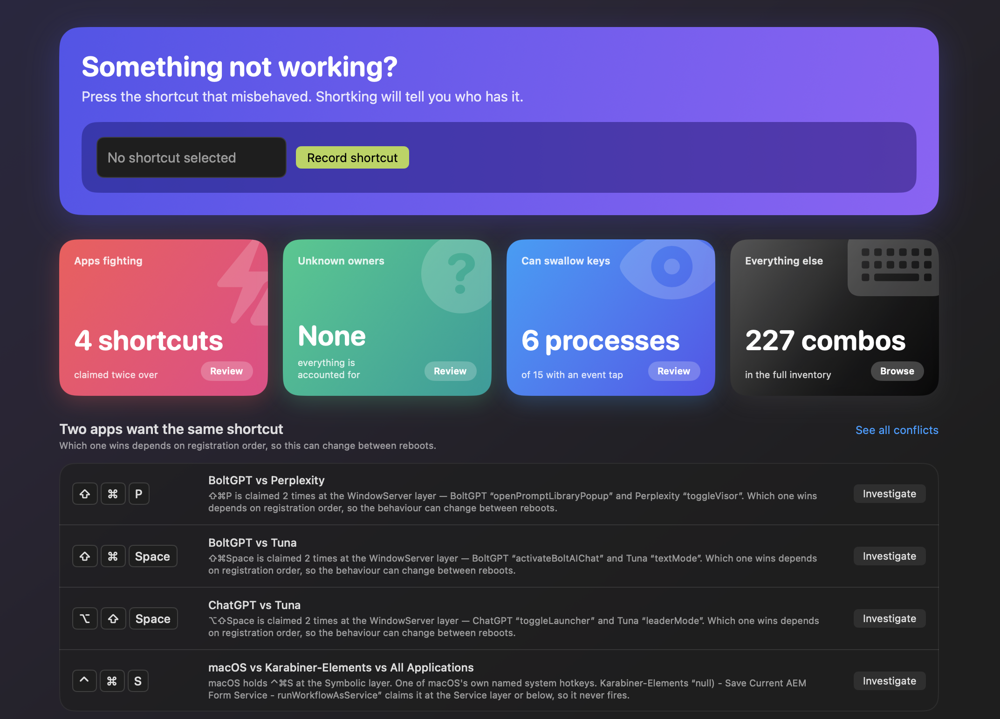

# Shortking

**Latest release:** v<!-- version -->1.0.1<!-- /version --> · [Download](https://github.com/L-K-M/Shortking/releases/latest)

> [!IMPORTANT]
> LLM Disclosure: Shortking was built with substantial help from large language models — primarily Anthropic's Claude, via Claude Code. Much of the code arrived through AI-authored commits and `claude/*` pull-request branches, with agent guidance kept in [`AGENTS.md`](AGENTS.md)



**The king of shortcuts.** A macOS diagnostic tool that answers two questions:

1. **What key combinations are currently claimed on this machine, by whom, and at what layer?**
2. **I just pressed ⌘⇧G and the wrong thing happened. Who ate it?**

Shortking is a *diagnostic*, not a shortcut manager. It never rebinds anything on your behalf. The
only system state it changes is transient and always restored.

[](https://github.com/L-K-M/Shortking/actions/workflows/ci.yml)

---

## Why it exists

A complete enumeration of every globally registered shortcut on macOS is impossible with public
APIs. The registry for Carbon-style global hotkeys lives inside WindowServer, keyed by
`(CGS connection ID, hotkey ID)`, and there is no "list all" call. Worse, apps that grab keys via
event taps register *nothing* — there is no system state to read.

Every existing tool responds to this by silently omitting what it cannot see. Shortking does the
opposite: it makes "claimed, owner unknown" a first-class, visible state, and then offers to find
out who the owner is.

## What it reads

- **Menu bars** of every running app, via the Accessibility API, cached per app version.
- **macOS system shortcuts**, from `com.apple.symbolichotkeys.plist` *and* live via SkyLight — the
  live path catches defaults that were never written out and MDM-managed values.
- **User-assigned App Shortcuts** (`NSUserKeyEquivalents`) across every preference domain.
- **Services** (`pbs.plist`) and **input source** switching.
- **Third-party configs**: Karabiner-Elements, skhd, Hammerspoon, VS Code and its forks, JetBrains
  IDEs.
- **Any app using MASShortcut, ShortcutRecorder, or `KeyboardShortcuts`** — three parsers that
  between them cover hundreds of apps nobody wrote an adapter for.
- **Active event taps** (`CGGetEventTapList`) — the exact list of processes that can intercept a
  keystroke.
- **Installed app binaries** (`nm -u`) — which apps can claim a global hotkey at all, including
  apps that are not running.

## What it infers

Every binding carries an explicit **layer**, **status** and **confidence**. Nothing inferred is ever
rendered as a fact.

| Status | Meaning | Confidence |
|---|---|---|
| `known` | Read directly from a config, plist, or the Accessibility API | 1.0 |
| `probedClaimed` | Registration was refused — someone holds it, owner unknown | 0.5 |
| `inferred` | Attributed by differential or side-channel evidence | 0.3 – 0.95 |
| `capability` | This process *could* intercept keys; no specific binding known | 0.1 |

Attribution confidence never reaches 1.0, and one contradicting observation costs twice what one
confirming observation gains. A wrong name is worse than no name.

## Detective Mode

Three techniques, each independently runnable:

- **Live capture** — attaches listen-only per-pid taps to the suspect set, masked on
  `NX_SYSDEFINED`. When WindowServer matches a hotkey it delivers a system-defined event to exactly
  one process. That process is your answer, by name, at press time.
- **Blackout test** — disables every WindowServer hotkey for a few seconds. If your shortcut
  suddenly works, a Carbon hotkey was eating it; if not, the cause is an event tap, a Karabiner
  remap, secure input, or the app itself.
- **Identify by restart** — binary-searches the suspects by watching which combinations free up as
  apps quit. log₂(n) restarts rather than one per app. (Suspending a process does not work —
  WindowServer registrations are held by the connection, not the thread.)

Underneath all three, side-channel correlation watches CPU, new windows and activation changes —
the only technique that sees event-tap claimants, which register nothing and cannot be probed.

## Safety

Two things Shortking does could break your keyboard if done carelessly. Both are engineered so they
cannot:

- **Probing** momentarily registers a combination to see whether it is available. Every
  registration is released immediately in a `defer`, and the whole sweep runs in a **separate
  short-lived helper process** (`shortking-probe`) with signal handlers and a watchdog — so even a
  hard crash mid-sweep is cleaned up by the OS rather than leaving combinations held.
- **Blackout** disables global hotkeys temporarily. The previous mode is restored on `defer`, on
  app termination, in `deinit`, and by an independent watchdog timer that fires even if the UI is
  wedged. Accessibility shortcuts are never disabled. A full-width banner with a countdown and a
  **Restore now** button is visible the entire time.

## Building

Requires macOS 14+ and a Swift 5.9+ toolchain.

```bash
scripts/build.sh          # assemble build/Shortking.app and reveal it in Finder
scripts/build.sh --run    # …and launch it
scripts/build.sh --clean  # reset a wedged Swift build service, then build
make test                 # unit tests
```

`scripts/build.sh` is a thin stub over the shared
[lkm-build](https://github.com/L-K-M/release-tool) engine; it drives the same `make app`
described below, and adds `--install` (to `/Applications`), `--zip` and `--dmg`. The
Makefile remains the underlying entry point and works on its own:

```bash
make app      # assembles build/Shortking.app — this is what you want
make run      # assemble and launch
make test     # unit tests
```

**Build the bundle, not the bare binary.** TCC identity is bundle- and signature-based: run the
executable straight out of `.build/` and `AXIsProcessTrusted()` reports on whatever launched it,
not on Shortking. The Health screen detects and warns about this, but it is worth knowing up front.

For a signed, notarized build:

```bash
make app SIGN_IDENTITY="Developer ID Application: Your Name (TEAMID)"
make notarize KEYCHAIN_PROFILE=shortking-notary
```

Published releases run exactly that path in CI — see [CICD.md](CICD.md). Cut one with
`scripts/release.sh 1.2.3 --push`, which bumps the version in `Resources/Info.plist`,
tags `v1.2.3`, and lets the release workflow build and publish it. With the Developer ID
secrets configured that is the signed, notarized path above; without them it falls back to
an ad-hoc signed build that Gatekeeper warns about, and the release notes say which one you
downloaded.

Shortking **cannot** ship on the Mac App Store: per-pid event taps are explicitly unsupported under
App Sandbox, and reading other apps' preference domains is restricted. Distribution is Developer ID
plus notarization.

## Permissions

| Capability | Requires | What you lose without it |
|---|---|---|
| Menu bar inventory | Accessibility | Every menu key equivalent on the system |
| Live capture | Input Monitoring | Detective Mode's instant attribution |
| Probe map, suspect list, configs | nothing | — |

The Health screen verifies permissions *functionally* rather than just asking the system, because
`AXIsProcessTrusted()` can return `true` for a binary with no grant of its own, and event taps can
be created successfully and then never fire after a code-signature change.
